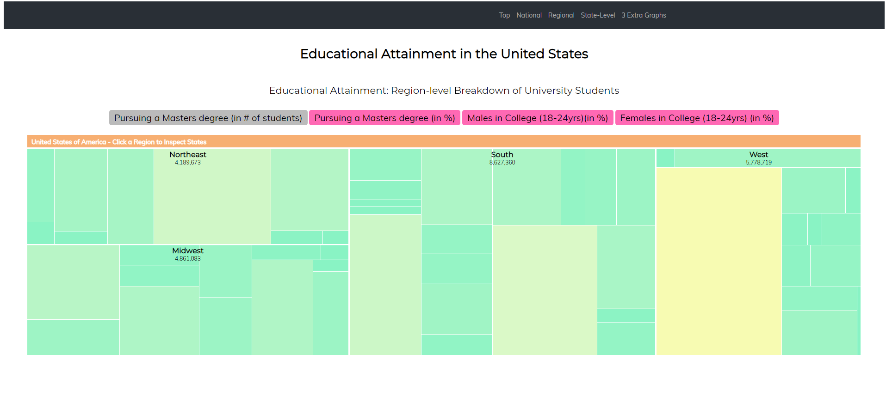
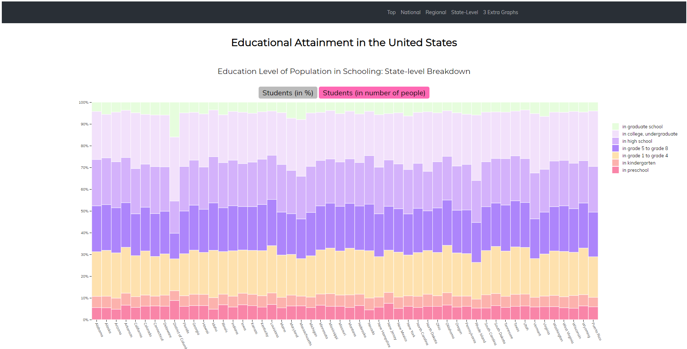
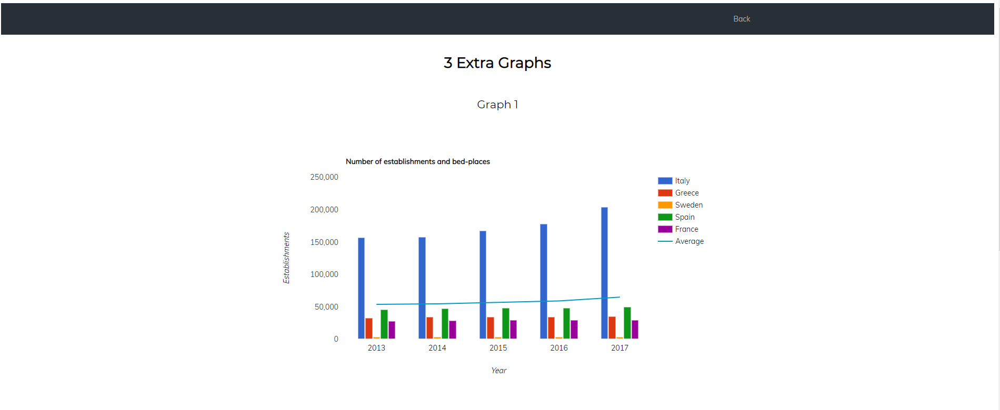
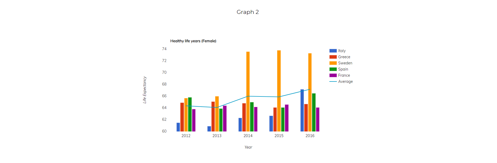

# Επικοινωνία Ανθρώπου-Υπολογιστή Τελική αναφορά
## Εργασία Ανάπτυξης: Οπτικοποίηση δεδομένων εκπαιδευτικού συστήματος (USA) Τελική αναφορά

Tελική αναφορά της εργασίας ανάπτυξης στο μάθημα HCI

### Ονοματεπώνυμο: Καλούδης Γιώργος Χαράλαμπος
# 
### ΑΜ: Π2017115
# 
Στην παρακάτω αναφορά, η οποία αποτελεί και την τελική αναφορά του μαθήματος, περιέχεται μία εισαγωγή σχετικά με την εργασία αυτή, καθώς και τα συμπεράσματα που προκύπτουν. Παράλληλα, αναλύονται σχετικά έργα και εργαλεία, μέθοδοι και τεχνικές ανάπτυξης αλλά και αποτελέσματα με λεζάντες σε ενδεικτικές οθόνες και animated gif. Παρακάτω δίνονται τα λινκ τα οποία είναι απαραίτητα για την πλήρη αξιολόγηση της εργασίας εξαμήνου: 

** Προφίλ του λογαριασμού στο github: https://github.com/p17kalo1 

** Εκτελέσιμο λινκ εργασίας: https://p17kalo1.github.io/D3js-US-educational-attainment/ 

** Link αποθετηρίου εργασλιας: https://github.com/p17kalo1/D3js-US-educational-attainment/

** Link αποθετηρίου τελικής αναφοράς:https://github.com/p17kalo1/hcireport/

### ΕΙΣΑΓΩΓΉ
# 

Στην εργασία ανάπτυξης Εκπλήρωσα όλα τα ζητούμενα του πρώτου παραδοτέου. Στο 2ο παραδοτέο εκπλήρωσα το πρώτο ζητούμενο. Το δεύτερο δεν τα κατάφερα. το τρίτο λόγω του ότι δεν είχα ασχοληθεί πολύ με την d3 χρησιμοποίησα την google charts βιβλιοθήκη. Σκέφτηκα ότι εινα καλύτερο να παραδοσω κάτι από το να μην παραδοσω τίποτα

### Σύντομη ανάλυση σχετικών έργων και εργαλείων

Για την δημιουργία της εργασίας, Χρησιμοποιήσαμε τις γλώσσες css, html και javascript. Τα εγαλεια που χρησιμοποιήσαμε ήταν κυρίως το github. και ιστοσελίδες με documentation από κωδικά. 

### Μέθοδος και τεχνικές ανάπτυξης

Τα βήματα που ακολούθησα για το πρώτο παραδοτέο ήταν τα εξής: 

** Αρχικά για την αλλαγή των χρωμάτων, μετά από αναζήτηση του source code βρήκα τα χρώματα στα αρχεία script_*. js. Με αναζήτηση για hexcode colors άλλαξα τα χρώματα των διαγραμμάτων με χρώματα της επιλογής μου* 
** Έπειτα για την αλλαγή των κουμπιών, μετά από αναζήτηση του source code, βρήκα τα στοιχειά των κουμπιών στα αρχεία css (stylesheet). Με την βοήθεια του site https://www.w3schools.com/ άλλαξα τα στοιχειά των κουμπιών* 
** Ύστερα για την προσθήκη ήχου όταν αγγίζει ο κέρσορας τα κουμπιά χρησιμοποίησα την λειτουργεια onmouseover. Για τον ήχο ύστερα από αναζήτηση στο google, βρήκα στο https://www.stackoverflow.com ένα javascript αρχείο το οποίο περιείχε την λειτουργεια του ήχου, το οποίο ανέβασα στα scripts του repository μου.* 
** Για το TTS χρησιμοποίησα το responsivevoice. και με την προσθήκη της λειτουργειας του στο onmouseover, αλλά και την διακοπή του στο onmouseleave* 
** Τέλος για την λειτουργεια της ιστοσελίδας σε διαφορετικά μεγέθη παραθύρου χρησιμοποιήθηκε το bootstrap

Για το δεύτερο παραδοτέο: 
** Για το πρώτο ζητούμενο χρησιμοποίησα μια συνάρτηση showhide (με την βοήθεια των https://www.w3schools.com/ https://www.stackoverflow.com). Η συνάρτηση αυτή κρύβει ή αποκαλύπτει το element div μεσώ αναζητης με το Id που της δίνουμε.* 
** Για τα 3 νέα γραφήματα δημιούργησα ένα νέο αρχείο 3graphs. html και την βιβλιοθήκη gooogle charts. Τα δεδομένα ήταν από τα eurostats.* 

### Aποτελέσματα με λεζάντες σε ενδεικτικές οθόνες και animated gif, συμπεράσματα

 
* Πρώτο διάγραμμα, στο οποίο έχει γίνει αλλαγή χρωμάτων, αλλαγή κουμπιών διεπαφών και τοποθέτηση responcivevoice* 

 
* Δεύτερο διάγραμμα (Ίδιες αλλαγές). 

 
Τρίτο διάγραμμα (Ίδιες αλλαγές). 

Eμφάνιση νέων διαδραστικών διαγραμμάτων στα οποία έχει τοποθετηθεί και το responcivevoice στον τίτλο. 
 

 

 

### Σύνοψη
Με την παραπάνω εργασία, κατάφερα να μάθω την χρήση των βιβλιοθηκών (π. χ. bootstap, d3), την δομή των ιστοσελίδων, και το πως μπορούμε να χρησιμοποιήσουμε javscript για την προσθήκη διάφορων λειτουργειων. Ακόμα έμαθα να χρησιμοπoιω καλύτερα το github και ιστοσελίδες όπως το stackoverflow και το w3schools. 

### Βιβλιογραφία και σύνδεσμοι

* https://www.w3schools.com/
* https://d3js.org/
* https://developers.google.com/chart/
* https://stackoverflow.com/
* https://responsivevoice.org/
* https://ec.europa.eu/eurostat/web/main/home
